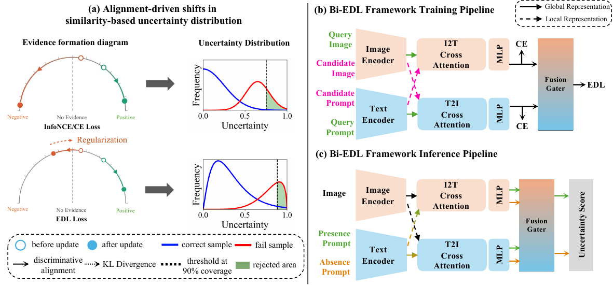

# Bi-EDL

**When Does Uncertainty Become Meaningful in Medical Vision–Language Models?
Alignment Enables Disease-wise Uncertainty and Risk-Aware Prediction**

*Tae Hun Kim, Hyun Gyu Lee — Inha University | MICCAI 2026*

---

## Overview

Recent Vision–Language Models (VLMs) demonstrate strong zero-shot chest X-ray performance, yet they lack reliable uncertainty estimation in multi-label clinical settings. Two root causes make existing similarity-based uncertainty methods inadequate:

1. **Misaligned negation** — When a model's representations do not differentiate *"There is Atelectasis"* from *"There is no Atelectasis"*, the gap between positive and negative similarity scores carries no clinical meaning. Uncertainty then reflects representational ambiguity rather than diagnostic confidence.

2. **Overconfident similarities** — Contrastive objectives (InfoNCE, cross-entropy) sharpen similarity distributions without bound, assigning high confidence even to incorrect predictions.

**Bi-EDL** is a fine-tuning framework that resolves both issues by jointly optimizing:

- **Bi-MCQ** (Bidirectional Multiple-Choice Questioning) — forces the model to discriminate *affirmative* from *negated* disease hypotheses in both image→text and text→image directions, establishing a disease-comparable representation space.
- **Beta-based EDL** — reinterprets the positive/negative alignment scores as evidence for a Beta distribution, regularizing overconfident similarities and yielding closed-form, disease-wise uncertainty: $U_k = 2 / (\alpha^+_k + \alpha^-_k)$.

The resulting uncertainty is directly usable for **selective prediction**: low-uncertainty cases are accepted automatically; high-uncertainty cases are flagged for human review (Fig. 2 of the paper).

---

## Architecture


**(a)** Evidence formation under InfoNCE/CE vs. EDL loss — EDL regularizes incorrect-direction evidence toward $\text{Beta}(1,1)$, shifting the uncertainty distribution to better separate correct from failed predictions.
**(b)** Training pipeline: bidirectional cross-attention (I2T + T2I) over query–candidate pairs produces alignment scores, jointly optimized with MCQ cross-entropy and EDL losses via a Fusion Gater.
**(c)** Inference pipeline: fixed presence/absence prompts per disease yield per-disease uncertainty scores for selective prediction.

**Backbone:** CARZero (ViT-B/16 image encoder + BioClinicalMPBERT text encoder + dual cross-attention fusion modules)

---

## Experiments

### Failure Detection (Table 1)

Bi-EDL vs. Bi-MCQ on NIH ChestXray-14 under **Normal** and **Covariate-Perturbed** (MedMNIST-C + RandomCrop/Affine) settings. Lower AURC and Risk@90 mean better selective risk control.

| Setting | Model | MSP | ODIN | Energy | MaxLogit | EDL |
|---|---|---|---|---|---|---|
| **Normal** | AURC↓ | | | | | |
| | Bi-MCQ | 0.0275 | 0.0318 | 0.0244 | 0.0247 | 0.0251 |
| | **Bi-EDL** | **0.0173** | **0.0171** | **0.0168** | **0.0168** | **0.0178** |
| **Normal** | Risk@90↓ | | | | | |
| | Bi-MCQ | 0.0558 | 0.0637 | 0.0544 | 0.0546 | 0.0562 |
| | **Bi-EDL** | **0.0336** | **0.0360** | **0.0335** | **0.0335** | **0.0350** |
| **Covariate** | AURC↓ | | | | | |
| | Bi-MCQ | 0.0314 | 0.0376 | 0.0310 | 0.0310 | 0.0670 |
| | **Bi-EDL** | **0.0257** | **0.0282** | **0.0254** | **0.0254** | **0.0260** |

### Ablation Study (Table 2)

Stepwise contribution of alignment (Bi-MCQ) and evidential modeling (EDL):

| Model | Pos AUROC↑ | Neg AUROC↑ | AURC↓ (MaxLogit) | Risk@90↓ (MaxLogit) | Risk(1)↓ |
|---|---|---|---|---|---|
| **Bi-EDL** | **0.854** | **0.854** | **0.0178** | **0.0350** | **0.0549** |
| Bi-MCQ | 0.851 | 0.836 | 0.0247 | 0.0546 | 0.0796 |
| EDL Only | 0.795 | 0.795 | 0.129 | 0.164 | 0.180 |
| CARZero | 0.811 | 0.429 | 0.229 | 0.158 | 0.159 |

**Key findings:**
- CARZero's low Neg AUROC (0.429) confirms that the unaligned backbone cannot reliably distinguish presence from absence.
- EDL alone (without Bi-MCQ alignment) improves over CARZero but falls well short of Bi-MCQ — semantic alignment is a prerequisite for meaningful evidential uncertainty.
- Bi-EDL inherits alignment quality from Bi-MCQ while further suppressing overconfident similarities, concentragpugting misclassified samples into high-uncertainty regions.

---

## Dataset

[NIH ChestXray-14](https://nihcc.app.box.com/v/ChestXray-NIHCC) — 112,120 frontal-view chest X-ray images across 14 thoracic disease categories with severe class imbalance.

| Split | Size | Source |
|---|---|---|
| Train | 80,718 | All images not in `test_list.txt` (90%) |
| Val | 8,969 | Random 10% of training images |
| Test | 22,433 | Official `ChestXray-14/test_list.txt` |

**Disease categories:** Atelectasis, Cardiomegaly, Effusion, Infiltration, Mass, Nodule, Pneumonia, Pneumothorax, Consolidation, Edema, Emphysema, Fibrosis, Pleural Thickening, Hernia

---

## Installation

```bash
git clone https://github.com/Castella99/Bi-EDL
cd Bi-EDL

pip install -r requirements.txt
```

### Pretrained Weights

Download the Bi-EDL best model checkpoint and place it under `checkpoints/`:

[Download best_model.ckpt (Google Drive)](https://drive.google.com/file/d/1S9RUVR_EsRBLHdRBZAWc3opkol1q4y3j/view?usp=drive_link)

```
Bi-EDL/
└── checkpoints/
    └── best_model.ckpt
```

---

## Usage

### Training

```bash
bash train.sh
```

Or directly:

```bash
python train.py \
    --data_path /path/to/NIH \
    --cfg_path  configs/chest14_finetuning_llm_dqn_wo_self_atten_mlp_gl_Bi_EDL.yaml
```

### Inference & Uncertainty Evaluation

```bash
bash inference.sh
```

Or directly:

```bash
python inference.py \
    --ckpt_path  checkpoints/best_model.ckpt \
    --cfg_path   configs/chest14_finetuning_llm_dqn_wo_self_atten_mlp_gl_Bi_EDL.yaml \
    --data_path  /path/to/NIH \
    --method     msp energy maxlogit edl odin \
    --device     cuda:0 \
    --batch_size 128 \
    --coverage   0.9
```

**Output:**
1. Classification tables — Positive, Negative, and PNC AUROC per disease.
2. Uncertainty comparison — AURC, Risk@90, R(1) for each method.

| Argument | Default | Description |
|---|---|---|
| `--ckpt_path` | required | Lightning checkpoint (`.ckpt`) |
| `--cfg_path` | required | OmegaConf config (`.yaml`) |
| `--data_path` | required | NIH dataset root |
| `--method` | all 5 | `msp energy maxlogit edl odin` |
| `--device` | `cuda:0` | Compute device |
| `--batch_size` | `32` | Inference batch size |
| `--odin_eps` | `0.001` | ODIN perturbation magnitude |
| `--coverage` | `0.9` | Coverage point for Risk@coverage |
| `--per_label` | flag | Print per-class AURC breakdown |

---

## Uncertainty Methods

All five methods are applied post-hoc to the same (positive, negative) logit pair. Scores are higher-is-more-uncertain.

| Method | Score | Notes |
|---|---|---|
| **MSP** | $1 - \max\,\text{softmax}(z^+, z^-)$ | Maximum Softmax Probability baseline |
| **Energy** | $-\log(\exp(z^+) + \exp(z^-))$ | Free energy of the logit pair |
| **MaxLogit** | $-\max(z^+, z^-)$ | Logit-level analogue of MSP |
| **EDL** | $2 \,/\, (\text{softplus}(z^+)+1 + \text{softplus}(z^-)+1)$ | Beta vacuity; model's native uncertainty |
| **ODIN** | $1 - \max\,\sigma(x + \varepsilon \cdot \text{sign}(\nabla \mathcal{L}))$ | Input perturbation (Liang et al., ICLR 2018) |

---

## Evaluation Metrics

| Metric | Description |
|---|---|
| **Pos/Neg AUROC** | Discrimination of disease presence / absence per class |
| **AURC** | Area Under the Risk-Coverage curve — lower means better abstention on failures |
| **Risk@90** | Error rate when retaining the 90% most confident predictions |
| **Risk(1)** | Full-coverage error rate (= 1 − accuracy) |

---

## Configuration

Key parameters in `configs/chest14_finetuning_llm_dqn_wo_self_atten_mlp_gl_Bi_EDL.yaml`:

| Parameter | Default | Description |
|---|---|---|
| `train.weight` | `0.5` | Fusion Gater weight $w$ (i2t vs. t2i) |
| `train.lam` | `50` | Warmup epochs for $\lambda_e$ ramp |
| `train.edl_weight` | `0.1` | $\lambda_{KL}$ — KL regularization weight in $\mathcal{L}_\text{EDL}$ |
| `train.seed` | `14` | Random seed |
| `lightning.trainer.lr` | `1e-5` | Adam learning rate |
| `lightning.trainer.precision` | `16-mixed` | Mixed-precision training |
| `model.CARZero.multi` | `true` | Separate i2t/t2i fusion modules |
| `model.text.bert_type` | `Laihaoran/BioClinicalMPBERT` | Text encoder |
| `freeze.image/text/fusion` | `false` | Modules to freeze during fine-tuning |

---

## Repository Structure

```
Bi-EDL/
├── train.py                    # Training entry point
├── inference.py                # Inference + uncertainty evaluation
├── utils.py                    # Metrics (AUROC, PNC, AURC, temperature scaling)
├── train.sh / inference.sh     # Shell scripts
├── configs/
│   └── chest14_finetuning_llm_dqn_wo_self_atten_mlp_gl_Bi_EDL.yaml
├── finetune/
│   ├── finetuning_lightening.py   # MCQEDLLightModel — Bi-MCQ + EDL training logic
│   ├── finetuning_dm.py           # NIHDataModule
│   └── finetuning_dataset.py      # Dataset class
├── ChestXray-14/
│   └── test_list.txt              # Official NIH test split
├── checkpoints/                   # Model checkpoints
└── logs/                          # Training logs
```